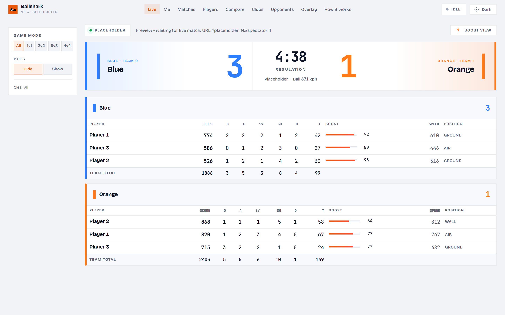
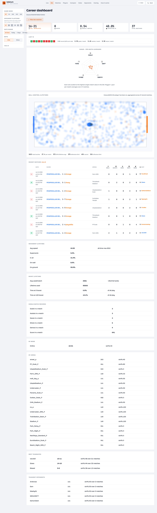
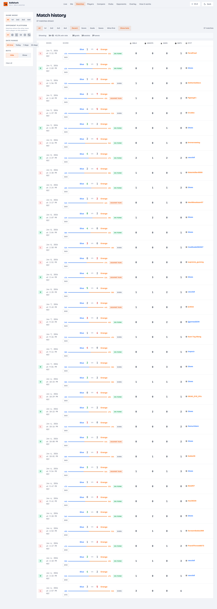
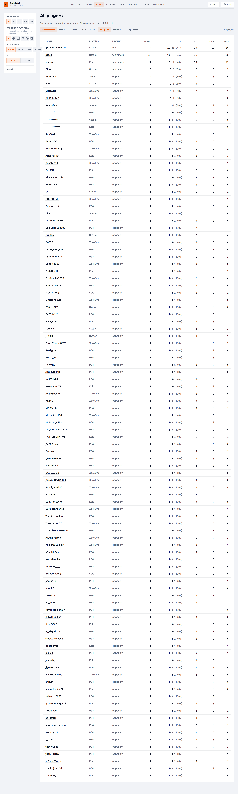
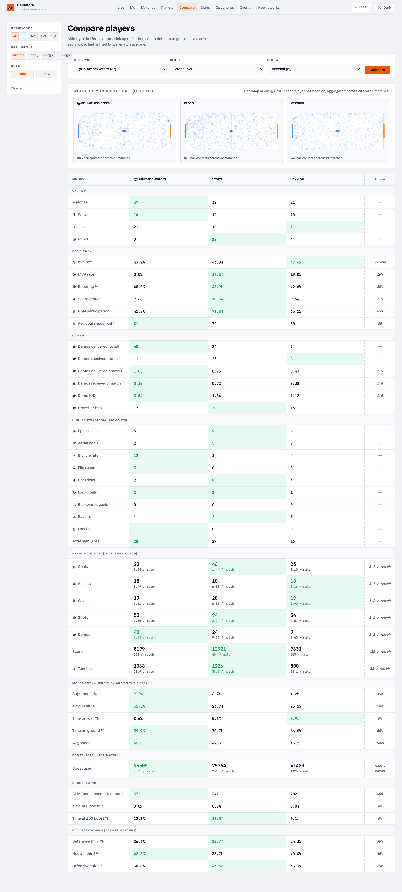
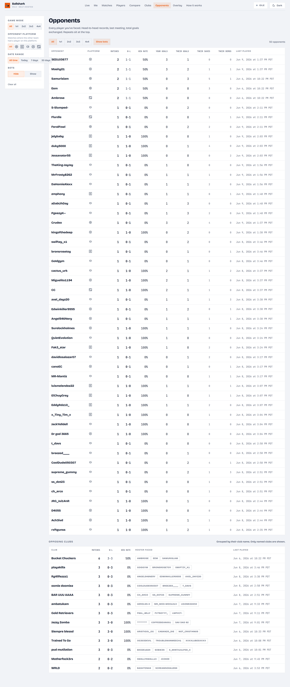
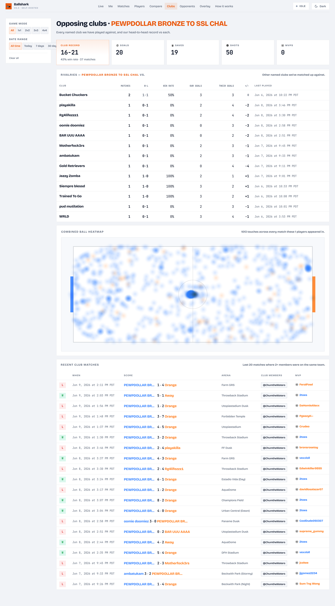

# ballshark

> 🚧 **Work in progress** — a personal project I'm actively building. Expect rough edges and breaking changes.

A self-contained Rocket League stats tracker. Lives on your machine, reads from the local Stats API that Rocket League itself opens, persists everything to a local SQLite DB, posts to your own Discord channel, and serves a local browser overlay.

**Zero third-party data sources.** No ballchasing, no tracker.gg, no Psyonix REST scraping. The only thing on the wire to a remote service is your Discord bot posting to your channel. Everything else is local.

## What you get

After every match:

- **Discord embed** posted to your channel — result badge, team-named score, your line (G/A/Sv/Sh/D), derived metrics (avg speed, supersonic %, time on wall/air/ground %, boost used), session running totals, match duration.
- **Browser overlay** at `http://127.0.0.1:5050/` — dark glass card with live boost bars + score during a match, last-game card between matches, session strip always at the bottom. Drop into OBS as a browser source or just open on a second monitor.
- **SQLite DB** with every event, every player line, every ball touch, every goal — keyed so you can run any query you want against your own history.

## Pages and views

Ballshark serves two surfaces: a **live overlay** (OBS-ready) and a full **analytics dashboard**. On a single machine both are served locally at `http://127.0.0.1:5050/`. In a multi-machine setup the analytics pages are served by the central server while each player's machine runs the overlay locally — see [Deployment](#deployment-single-machine-or-central-server).

> Screenshots below are from a live instance with real match data. They are refreshed as the UI changes.

### Live overlay — `/live`



*Live overlay: real-time scoreboard with per-player boost, speed and position, updated at the Stats API's 30 Hz during a match.*

- **Shows:** both rosters with live score, goals / assists / saves / shots / demos, touches, boost amount, speed, and ground/air/wall position while you play. Game-mode and hide-bots filters on the left; a dedicated **Boost view** strips it down to boost bars for streaming.
- **Plan:** richer between-match "last game" card, then a native always-on-top overlay window instead of a browser source.

### Career dashboard — `/dashboard` (and `/player/<name>` for anyone)



*Career dashboard: headline record, form, a ball-touch heatmap, recent matches, derived movement metrics, and splits by mode / arena / opponent.*

- **Shows:** lifetime wins-losses, win rate, recent-form dots, average goals; a touch heatmap built from logged `BallHit` positions; a recent-matches table; movement metrics (average speed, supersonic %, air/wall/ground time, boost used); single-match records; and breakdowns by playlist and by arena. `/player/<name>` renders the same page for any player you have ever shared a match with.
- **Plan:** date-window comparisons (this week vs last), and per-metric trend sparklines.

### Match history — `/history`



*Match history: every match in reverse-chronological order with result, score, mode, your line, and the opponents' club tags.*

- **Shows:** one row per match — result badge, blue/orange score bar, playlist, your goals/assists/saves, and the opposing club. Filter by mode, platform, date range, and bots; sort by recent, score, goals, saves, or best game. Each row links to its match-detail page.
- **Plan:** inline expand for the full scoreboard without leaving the list.

### Players directory — `/players`



*Players directory: everyone you have ever shared a match with — teammates, opponents, randoms — sorted by how often you have played with or against them.*

- **Shows:** name, platform, matches, goals, saves for every tracked player, with relation (all / teammates / opponents) and mode/platform/date filters. Click through to anyone's career page.
- **Plan:** chemistry indicators (win rate when teamed with each player).

### Compare players — `/compare`



*Compare players: up to three players side by side across the full stat sheet, with each player's touch heatmap and the best value in each row highlighted.*

- **Shows:** scoring, defense, positioning, supersonic/air time, per-match rates and totals for you plus two others (defaults to your most-played teammates), lifetime or windowed. Heatmaps per player at the top.
- **Plan:** save comparison presets; add head-to-head context (record when these players faced each other).

### Opponents — `/opponents`



*Opponents: every player you have faced, with your win-loss record against them, plus an opposing-clubs roll-up.*

- **Shows:** per-opponent matches, your record, win %, and goals for/against, sorted by how often you have met. A second table aggregates the clubs you have played against and the members you have seen in each.
- **Plan:** "nemesis" / "favourite victim" callouts and recent-form vs each opponent.

### Clubs — `/clan` (and `/club/<name>`)



*Clubs: group view for a chosen set of teammates (a "club"), aggregating the friend group's combined record and stats.*

- **Shows:** combined record and stats for a selected roster of teammates; `/club/<name>` drills into a single club tag seen in match data.
- **Plan:** this is the natural home for the multi-user friend-group leaderboard once more friends are uploading.

## What's in scope

| | |
|---|---|
| W / L, score, MVP attribution, team names | yes |
| Goals / assists / saves / shots / demos per player | yes |
| Goal speed (km/h), goal impact XYZ, who assisted | yes |
| Crossbar hits with ball location + impact force | yes |
| BallHit events with ball XYZ (touch heatmap data) | yes |
| Boost % per player at 30Hz | yes |
| Time on wall / on ground / in air %, boost used, supersonic %, avg+max speed | yes (derived from tick state) |
| Bot detection (PrimaryId = `Unknown\|0\|0`) | yes |
| Online vs offline distinction (MatchGuid presence) | yes |
| Cross-platform IDs (Steam / Epic / Switch) | yes |

## What's out of scope (by design)

These exist in other tools but require external services or replay-file parsing — neither of which ballshark does.

- MMR / rank / season standings (Psyonix doesn't emit them on this socket)
- Per-tick player XYZ positions (the API gives booleans and speed but not coordinates per player, so no positioning heatmaps from this data source)
- Camera settings, boost pickup maps (live API doesn't expose them)

If you want those: stop the project and play, then look at the in-game scoreboard. We're not chasing parity with replay-parsing sites.

## Quickstart

### 1. Install

```powershell
python -m venv .venv
.\.venv\Scripts\python.exe -m pip install -e .[dev,server,bot]
```

### 2. Enable the Stats API

```powershell
.\.venv\Scripts\python.exe -m ballshark.cli setup
```

Detects your RL install (Steam via registry + `libraryfolders.vdf`, or Epic via `Manifests\*.item`), backs up `DefaultStatsAPI.ini`, writes `PacketSendRate=30`. Idempotent — re-runs are no-ops if it's already enabled. Restart Rocket League afterward — the ini is only read on launch.

### 3. Configure `.env`

Copy `.env.example` to `.env` and fill in:

```env
DISCORD_TOKEN=<your bot token>
DISCORD_CHANNEL_ID=<numeric channel id>
RL_PLAYER_NAME=@YourInGameName
RL_PLAYER_PRIMARY_ID=Steam|7656...|0
```

Setup pointers:
- **Discord bot**: create at https://discord.com/developers/applications → New Application → Bot → Reset Token. Invite to your server with `bot` scope and `Send Messages` + `Embed Links` permission.
- **Channel ID**: enable Developer Mode in Discord (User Settings → Advanced), right-click the channel → Copy Channel ID.
- **Your primary_id**: easiest path — play one match with `ballshark run`, look at `data/ballshark.db` → `match_player_stats`, find your name, copy the `primary_id` field. Or pull it from any `UpdateState` row in a `.jsonl` capture.

### 4. Run

```powershell
.\.venv\Scripts\python.exe -m ballshark.cli run
```

Three things start:
- **Ingest** connects to `127.0.0.1:49123` (RL's local TCP socket)
- **Server** serves the overlay at `http://127.0.0.1:5050/`
- **Bot** logs into Discord and posts on each `MatchEnded`

`--no-bot` and `--no-server` flags exist if you want to run just one part. Ctrl+C stops everything.

## CLI

```
ballshark setup [--rate 30 | --disable] [--rl-path C:\...\rocketleague]
ballshark run [--no-bot] [--no-server] [--host ...] [--port 49123]
ballshark replay <file...>                # backfill captures into the DB
ballshark post-test <file...>             # one-shot Discord embed sanity check
ballshark stats --primary-id "Steam|...|0"   # lifetime aggregates from the DB
```

## Deployment: single machine or central server

Ballshark runs in one of two shapes.

**Single machine (default).** `ballshark run` on your gaming PC does everything: ingest from the Stats API, local SQLite, Discord embed, local overlay, and the full dashboard at `http://127.0.0.1:5050/`. Nothing leaves your machine except the Discord post.

**Central server (friend group).** An always-on box (here: a Mac mini, `welsh-macmini`) runs `ballshark serve` — the same FastAPI app with no RL ingest. Each player's machine runs `ballshark run` and uploads finalized match summaries to it; the server dedupes by RL `MatchGuid` and serves one unified dashboard for the whole group.

```
 your gaming PC                       friends' PCs
 ballshark run ── upload ─┐          ┌─ ballshark run
                          ▼          ▼
                  central server (ballshark serve)
                  /dashboard /history /players /clan ...
                          │
              Tailscale  (welsh-macmini:5050)
              + optional Cloudflare Tunnel → https://<your-domain>
```

What works **today** (implemented, not just spec):

- `ballshark serve` — central FastAPI app + match-summary upload endpoint (`src/ballshark/server.py`).
- `src/ballshark/sync.py` — client uploads each finalized match, auth via `X-Ballshark-Key`; the server rejects rows that claim a primary_id the key doesn't own.
- `ballshark admin create-user` / `list-users` — provision one API key per friend.
- `ballshark push-history` — backfill an existing local DB to the central server.
- Reachable over Tailscale (`http://<host>:5050`) with no public DNS.

To stand up the central server, see [`deploy/macmini/README.md`](deploy/macmini/README.md). To make a client upload, set in its `.env`:

```env
BALLSHARK_REMOTE_URL=http://<central-host>:5050
BALLSHARK_API_KEY=<key from `ballshark admin create-user`>
```

**Public domain (optional).** For access beyond your tailnet, put the server behind a Cloudflare Tunnel and point a domain at it (see [deploy/macmini/README.md](deploy/macmini/README.md#cloudflare-tunnel-public-access)), then set `BALLSHARK_PUBLIC_URL=https://<your-domain>` so shared links (the Discord "view match" link) use it.

### Start on Windows login

The owner's machine launches the tray app (which runs `ballshark run`) from a per-user `Run` registry entry — no admin rights, no Task Scheduler service. The tray's **Start with Windows** toggle writes/removes that entry (`src/ballshark/autostart.py`), and a single-instance lock (a loopback bind on port 5051) stops a second launch from spawning a duplicate server.

## Project layout

```
src/ballshark/
  models.py           pydantic types for every observed Stats API event
  ingest.py           TCP client + brace-aware JSON splitter + reconnect
  session.py          MatchAggregator + SessionTracker (W/L, streak, derived metrics)
  store.py            SQLite (matches, match_player_stats, raw_events, match_extras)
  config.py           env / .env loader
  config_wizard.py    detect RL install, read/write DefaultStatsAPI.ini
  bot.py              discord.py poster + embed builder
  server.py           FastAPI + WS overlay backend
  overlay/            HTML / CSS / JS for the browser overlay
  cli.py              `ballshark` entry point
captures/             .jsonl + .bin raw socket dumps from capture.ps1
data/                 SQLite DB - gitignored
tests/                pytest suite against the real captures
capture.ps1           standalone PowerShell recorder (no install needed)
capture.py            same, Python stdlib only
```

## What's persisted

Four tables. Everything stays — we can re-derive new metrics from `raw_events` without playing more matches.

- `matches` — id, started_at/ended_at, arena, scores, team0/1 names + colors, winner, online flag, crossbar count
- `match_player_stats` — name, primary_id, team, G/A/Sv/Sh/D, score, MVP, is_bot, platform, ticks_total + per-state counters (on_wall/on_ground/in_air/boosting/supersonic/zero_boost/full_boost), speed_sum, speed_max, boost_used
- `match_extras` — match_id, duration_seconds, ball_touches (JSON array of `{t,x,y,z,player,team_num,pre_speed,post_speed}`), goal_events (deduped JSON)
- `raw_events` — every envelope ever seen with match_id link; primary archive for reprocessing

## Capturing raw data without the pipeline

If you want to record a session without `ballshark run` (to share fixture data or develop offline):

```powershell
.\capture.ps1
```

Connects to RL's socket, writes raw bytes (`.bin`) and parsed envelopes (`.jsonl`) to `captures/`. Ctrl+C to stop. The `.jsonl` is easy to grep, the `.bin` is the source of truth.

## Testing

```powershell
.\.venv\Scripts\python.exe -m pytest tests/
```

13 tests cover envelope parsing, aggregator correctness on online + exhibition matches, the goal-replay-echo dedupe quirk, the SQLite roundtrip, the wizard's idempotency and comment-preserving write.

## Stats API reference

Documented by Psyonix at https://www.rocketleague.com/en/developer/stats-api . Enabled via `<RL install>\TAGame\Config\DefaultStatsAPI.ini`:

```ini
[TAGame.MatchStatsExporter_TA]
Port=49123
PacketSendRate=30
```

`PacketSendRate=0` disables the API entirely; `1-120` sets the periodic UpdateState frequency. Configuration is read at launch — change the ini, restart RL.

The socket emits concatenated UTF-8 JSON envelopes:
```
{"Event":"<name>","Data":"<json-encoded string>"}
```
The `Data` field is a JSON string — parse twice. Events observed in real captures:

`MatchCreated`, `MatchInitialized`, `MatchDestroyed`, `MatchEnded`, `MatchPaused`, `MatchUnpaused`, `CountdownBegin`, `RoundStarted`, `UpdateState`, `ClockUpdatedSeconds`, `BallHit`, `GoalScored`, `CrossbarHit`, `StatfeedEvent`, `ReplayPlaybackStart`, `ReplayPlaybackEnd`, `ReplayWillEnd`.

## Future (still self-contained)

- Native desktop overlay (transparent always-on-top PyQt window) instead of browser
- Discord Rich Presence — show your live line on your profile
- Per-session challenge / bingo tracker
- Touch-heatmap rendering in the overlay (we already capture the XYZ data)
