# chumstats

> A **self-hosted Rocket League stats tracker**. It reads the **local Stats API** that Rocket League
> opens on your own machine, writes every match to **SQLite**, posts a **Discord embed**, and serves
> a **web dashboard** + **OBS overlay** — for you *and* your whole friend group. **Zero third-party
> data sources**: no ballchasing, no tracker.gg, no Psyonix scraping. The only thing on the wire is
> your own Discord post.

<p align="center">
  <a href="https://chumstats.com"><b>▶&nbsp;Live&nbsp;dashboard</b></a>
  &nbsp;·&nbsp; <a href="#how-it-works">How&nbsp;it&nbsp;works</a>
  &nbsp;·&nbsp; <a href="#deployment-one-machine-or-a-whole-friend-group">Deployment</a>
  &nbsp;·&nbsp; <a href="#stats-api-reference">Stats&nbsp;API</a>
  <br><sub><b><a href="https://chumstats.com">chumstats.com</a></b> is a live instance with real data from my friend group — <b>950+ players</b> across <b>390+ matches</b>.</sub>
</p>

<p align="center">
  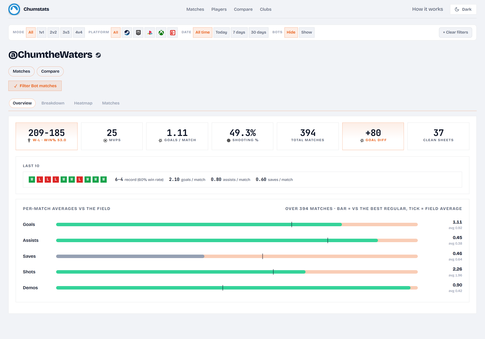
</p>
<p align="center"><sub>The <b>career dashboard</b> for any player you've ever shared a match with — lifetime record, recent form, and every per‑match average measured <b>against the field</b>.</sub></p>

<p align="center">
  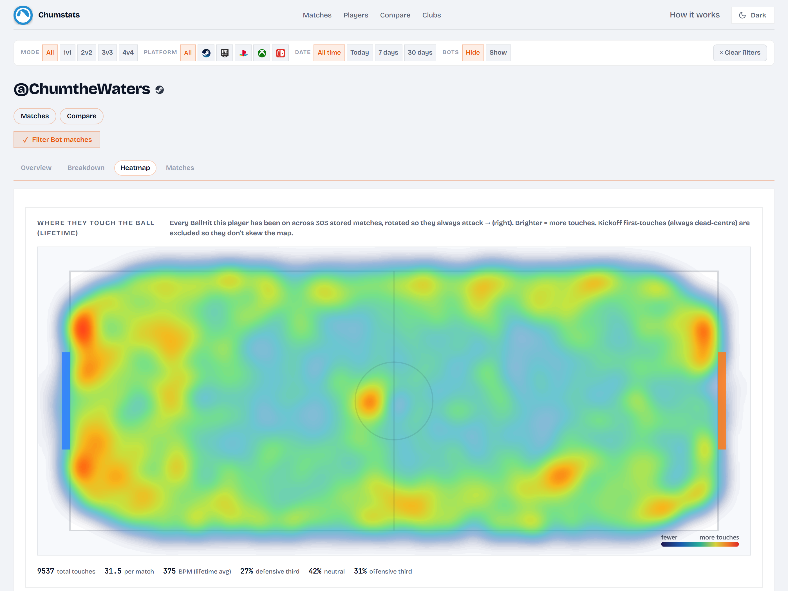
</p>
<p align="center"><sub>A <b>touch heatmap</b> from every logged <code>BallHit</code> — here <b>9,500+ touches across 300+ matches</b>, rotated so the player always attacks → and split into thirds (kickoff touches excluded so they don't skew it).</sub></p>

<p align="center">
  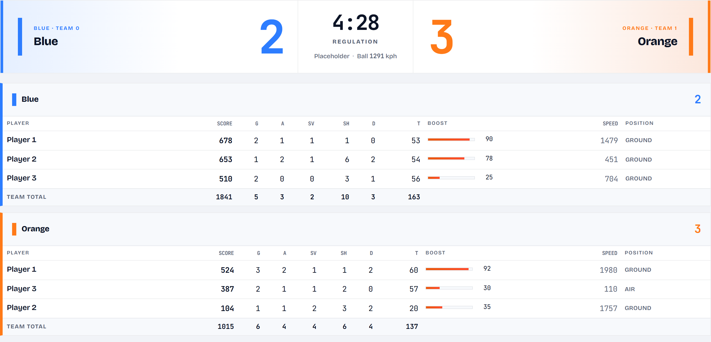
</p>
<p align="center"><sub>The <b>live overlay</b> — both rosters at the Stats API's 30&nbsp;Hz: score, the full stat line, <b>boost bars</b>, speed and position. Drop it into OBS as a browser source, or open it on a second monitor.</sub></p>

---

## Go deep on every player and match

Every match is stored down to the last ball touch, so the UI can actually dig in: a per‑goal
**timeline**, a **goal map**, side‑by‑side **compare** with heatmaps, a full single‑player
**breakdown** sheet, and filterable **match** / **player** directories that roll up into a
friend‑group **club** view. One unified site — served locally at `http://127.0.0.1:5050/`, or from a
central host for the whole group (see [Deployment](#deployment-one-machine-or-a-whole-friend-group)).

<table>
  <tr>
    <td width="50%" align="center">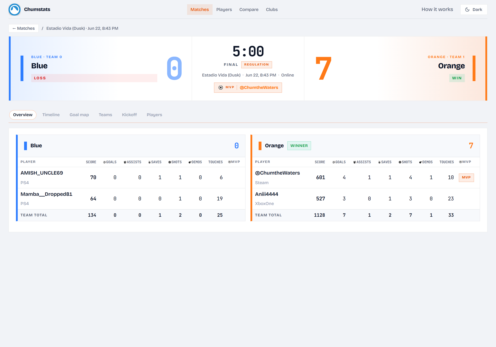<br><b>Match</b> <code>/match/&lt;id&gt;</code> — the full box score</td>
    <td width="50%" align="center">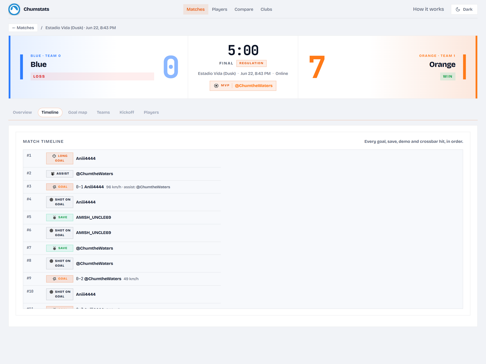<br><b>Timeline</b> — every goal / save / demo, with goal speeds</td>
  </tr>
  <tr>
    <td width="50%" align="center">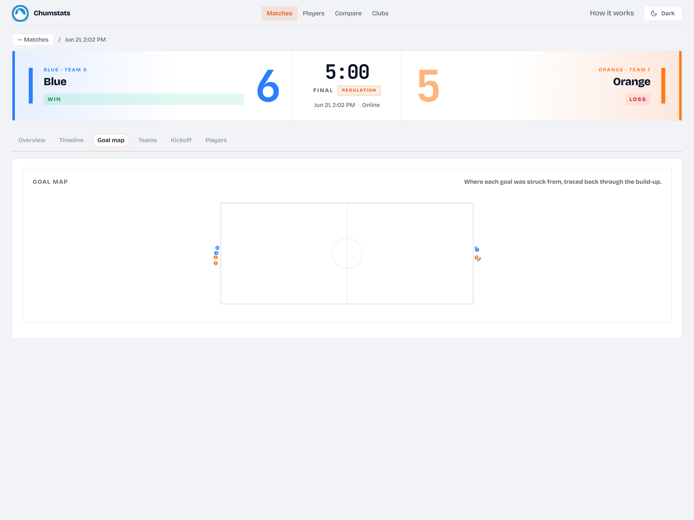<br><b>Goal map</b> — where each goal was struck from</td>
    <td width="50%" align="center">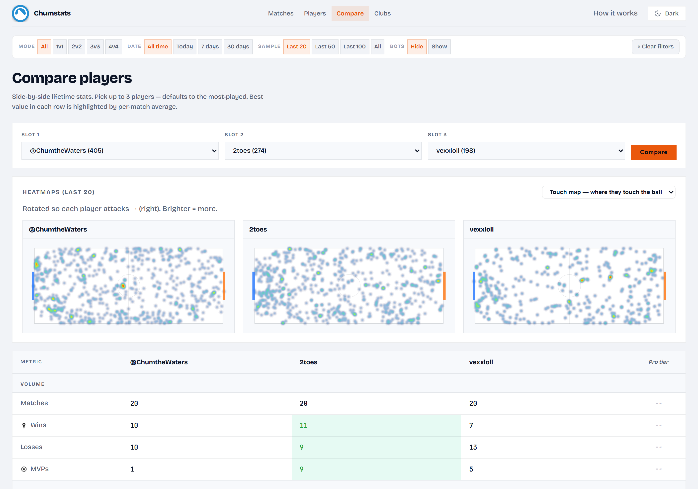<br><b>Compare</b> <code>/compare</code> — up to 3 players + heatmaps</td>
  </tr>
  <tr>
    <td width="50%" align="center">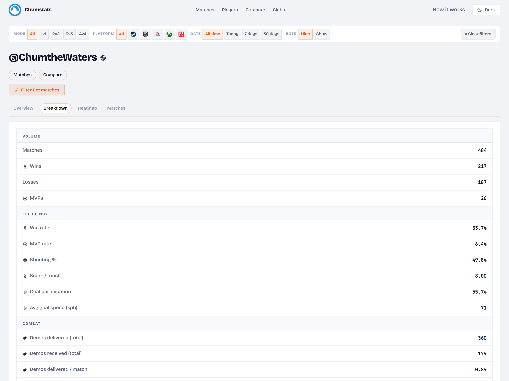<br><b>Breakdown</b> — every captured stat on one sheet</td>
    <td width="50%" align="center">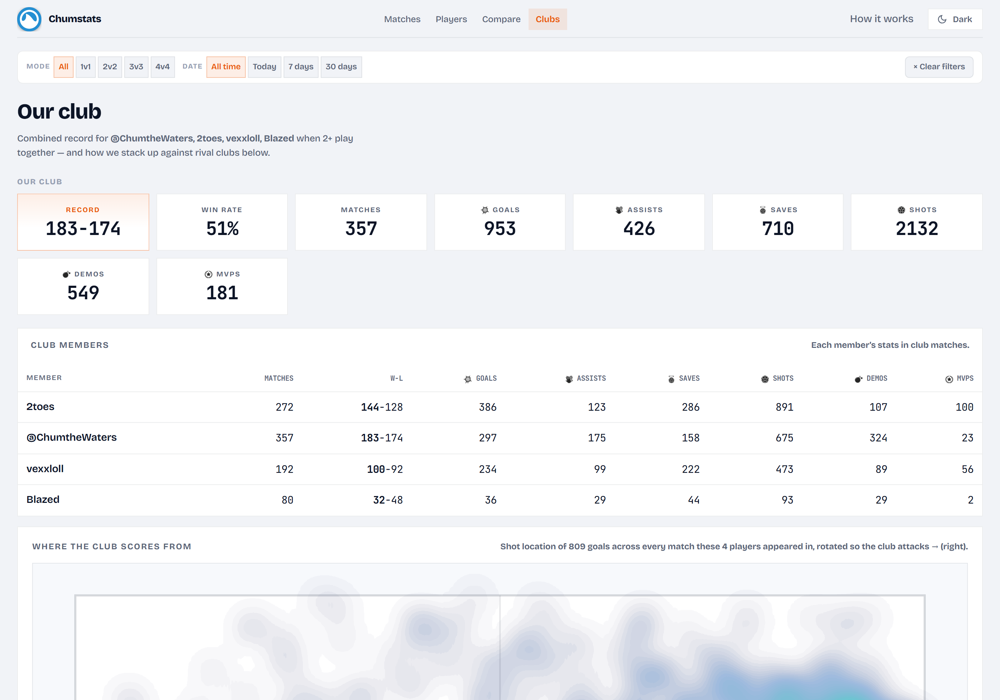<br><b>Clubs</b> <code>/clan</code> — a friend group's combined record</td>
  </tr>
  <tr>
    <td width="50%" align="center">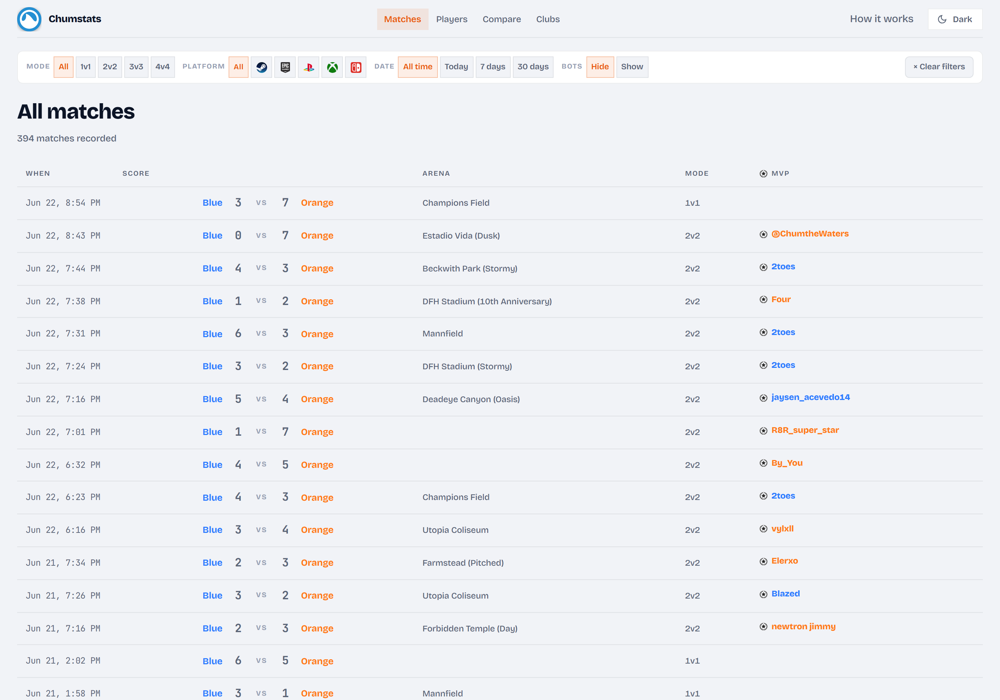<br><b>Matches</b> <code>/history</code> — every game, filter + sort</td>
    <td width="50%" align="center">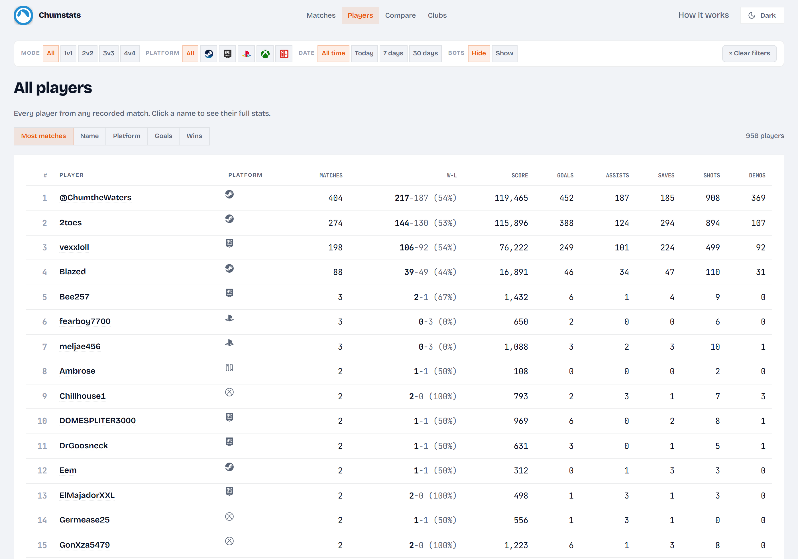<br><b>Players</b> <code>/players</code> — everyone from every match</td>
  </tr>
</table>

## What it is

chumstats is a small Python service you run next to Rocket League. RL itself ships a local **Stats
API** — a loopback TCP socket that streams JSON for everything happening in your matches. chumstats
connects to it, aggregates each match (W/L, the full stat line, and movement metrics derived from the
30&nbsp;Hz tick state), and fans the result out three ways: a **Discord embed** in your channel, a
**SQLite** row you can query forever, and a **web dashboard + live overlay**. Point a few friends'
machines at one central instance and it becomes a shared, deduped tracker for the whole group — still
with no external data source in the loop.

It captures what's actually on that socket, and deliberately stops there:

| What it captures | |
|---|---|
| W / L, score, MVP attribution, team names + colors | yes |
| Goals / assists / saves / shots / demos per player | yes |
| Goal speed (km/h), goal impact XYZ, who assisted | yes |
| Crossbar hits with ball location + impact force | yes |
| Ball‑hit events with XYZ → the **touch heatmap** | yes |
| Boost % per player at 30&nbsp;Hz | yes |
| Time on wall / ground / in air %, boost used, supersonic %, avg + max speed | yes — derived from tick state |
| Bot detection · online‑vs‑offline · cross‑platform IDs (Steam / Epic / PS / Xbox / Switch) | yes |
| MMR / rank / season standings | **no** — Psyonix doesn't emit them on this socket |
| Per‑tick player XYZ, camera settings, boost‑pickup maps | **no** — not exposed by the live API |

> Those last two need replay‑file parsing or external services. chumstats isn't chasing parity with
> replay sites — if you want them, stop the project, play, and read the in‑game scoreboard.

## Requirements

- **Rocket League** with the Stats API enabled (`chumstats setup` does this). Ingest runs on the
  machine RL runs on — i.e. **Windows**.
- **Python 3.11+**.
- *(optional)* A **Discord bot** token + channel, if you want the post‑match embeds.
- *(optional)* An always‑on **Linux/macOS host** (mini PC, NAS, spare Mac) to be the central server
  for a friend group.

## Install / run

```powershell
# 1. Install (server + bot + tray extras; drop any you don't want)
python -m venv .venv
.\.venv\Scripts\python.exe -m pip install -e .[dev,server,bot]

# 2. Enable RL's Stats API — finds your install (Steam/Epic), writes PacketSendRate=30.
#    Idempotent; restart Rocket League afterward (the .ini is only read at launch).
.\.venv\Scripts\python.exe -m chumstats.cli setup

# 3. Configure secrets — copy the example and fill in your Discord token + in-game name.
copy .env.example .env       # then edit .env

# 4. Run everything: ingest + overlay server + Discord bot.
.\.venv\Scripts\python.exe -m chumstats.cli run
#    Ingest -> 127.0.0.1:49123 (RL's socket) · overlay/dashboard -> http://127.0.0.1:5050/
#    Bot logs into Discord and posts on every MatchEnded. Ctrl+C stops all three.
#    Flags: --no-bot  --no-server  to run just one part.
```

`.env` essentials (see [`.env.example`](.env.example) for the rest):

```env
DISCORD_TOKEN=<your bot token>          # discord.com/developers → New Application → Bot → Reset Token
DISCORD_CHANNEL_ID=<numeric channel id> # enable Developer Mode, right-click channel → Copy ID
RL_PLAYER_NAME=@YourInGameName
RL_PLAYER_PRIMARY_ID=Steam|7656...|0    # grab from data/chumstats.db after one match, or a capture
```

### CLI

```
chumstats setup        # detect RL install, enable the Stats API (--rate / --disable)
chumstats run          # ingest live + overlay server + Discord bot (--no-bot / --no-server)
chumstats serve        # central-server mode: the web app, no RL ingest
chumstats replay <f…>  # backfill .jsonl captures into the DB
chumstats reprocess    # re-derive matches from raw_events after a parser fix
chumstats post-test    # one-shot Discord embed sanity check
chumstats player|players|compare|match|vs|stats   # the dashboards, in the terminal
chumstats push-history # backfill an existing local DB to the central server
chumstats admin create-user|list-users            # provision one API key per friend
```

On Windows the owner usually runs the **tray app** instead — it launches `chumstats run`, shows
ingest/Discord status, and its **Start with Windows** toggle writes a per‑user `Run` entry (no admin,
no Task Scheduler). A single‑instance lock (a loopback bind on port 5051) stops a second launch from
spawning a duplicate.

## How it works

```
 Rocket League ──TCP 127.0.0.1:49123──▶ ingest.py ──▶ session.py ──▶ store.py (SQLite)
 (local Stats API, 30 Hz JSON)          (drain +       (aggregate     │
                                          reconnect)     W/L, metrics) ├──▶ bot.py        → Discord embed
                                                                       ├──▶ server.py     → dashboard + /live
                                                                       └──▶ sync.py       → central server (optional)
```

1. **Ingest** (`ingest.py`) opens RL's loopback socket and splits the concatenated JSON envelopes. A
   dedicated reader thread keeps the socket drained no matter how slow disk/upload work is — so RL's
   game thread never blocks on `send()` (see the [Stats API note](#stats-api-reference)).
2. **Aggregate** (`session.py`) folds the event stream into one match: the scoreboard, MVP, and the
   movement metrics derived from the 30&nbsp;Hz `UpdateState` ticks.
3. **Persist** (`store.py`) writes four tables — and keeps **every raw envelope**, so new metrics can
   be re‑derived later (`chumstats reprocess`) without playing another game.
4. **Fan out**: a Discord embed (`bot.py`), the dashboard + live overlay (`server.py`), and — if
   configured — an upload to a central server (`sync.py`).

**What's persisted** (four tables, nothing thrown away):

- `matches` — times, arena, scores, team names + colors, winner, online flag, crossbar count
- `match_player_stats` — name, primary_id, team, G/A/Sv/Sh/D, score, MVP, is_bot, platform, plus
  per‑state tick counters (on_wall / on_ground / in_air / boosting / supersonic / …), speed, boost used
- `match_extras` — duration, ball‑touch XYZ array (the heatmap), deduped goal events
- `raw_events` — every envelope ever seen, linked to its match — the primary re‑processing archive

### Deployment: one machine, or a whole friend group

**Single machine (default).** `chumstats run` on your gaming PC does everything; nothing leaves the
box except the Discord post.

**Central server (friend group).** An always‑on host runs `chumstats serve` — the same web app with
no RL ingest. Each player's machine runs `chumstats run` and uploads finalized match summaries to it;
the server dedupes by RL `MatchGuid` and serves one unified dashboard for the group.

```
 your gaming PC                        friends' PCs
 chumstats run ── upload ─┐           ┌─ chumstats run
                          ▼           ▼
                  central server (chumstats serve)
                  /  /players  /history  /compare  /clan  …
                          │
              VPN / LAN  (<server-host>:5050)
              + optional Cloudflare Tunnel → https://chumstats.com
```

A client opts in with two lines in its `.env`; uploads authenticate with `X-Chumstats-Key`, and the
server rejects any row claiming a `primary_id` the key doesn't own:

```env
CHUMSTATS_REMOTE_URL=http://<central-host>:5050
CHUMSTATS_API_KEY=<key from `chumstats admin create-user` on the server>
```

Stand the server up with [`deploy/server/`](deploy/server/) (an `install.sh` + a launchd template);
expose it publicly with the documented Cloudflare Tunnel and set `CHUMSTATS_PUBLIC_URL` so shared
links (the Discord "view match" button) use your domain. The live instance behind
**[chumstats.com](https://chumstats.com)** runs exactly this — a neutral landing that jumps straight
into anyone's career:

<p align="center">
  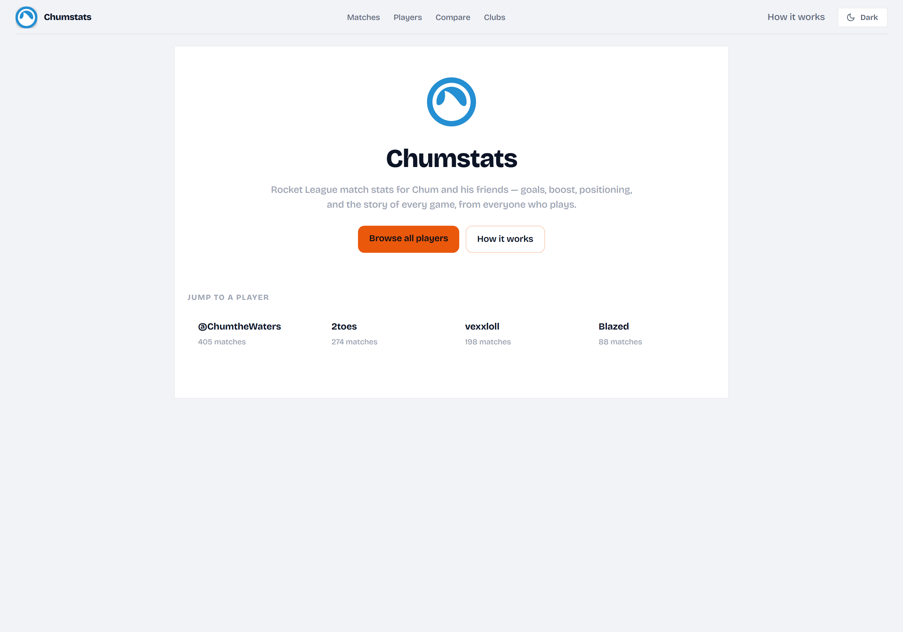
</p>

## Repo layout

```
src/chumstats/
  ingest.py          TCP client + brace-aware JSON splitter + reconnect      ← source of truth: the socket
  models.py          pydantic types for every observed Stats API event
  session.py         MatchAggregator + SessionTracker (W/L, streak, metrics) ← source of truth: a match
  store.py           SQLite — matches / match_player_stats / match_extras / raw_events  ← source of truth: data
  analytics.py       dashboard/compare/club aggregates queried from the DB
  server.py          FastAPI app: dashboard, all pages, /live + /overlay WS  ← source of truth: the web UI
  sync.py            client upload + server ingest of finalized matches (multi-user)
  bot.py             discord.py poster + embed builder
  config.py          env / .env loader (+ legacy-name fallbacks)
  config_wizard.py   detect RL install, read/write DefaultStatsAPI.ini
  cli.py             the `chumstats` entry point
  tray.py / tray_*   Windows tray app, friend-bundle config + setup wizard
  autostart.py       Windows per-user Run-key autostart toggle
  overlay/           HTML / CSS / JS for the browser overlay + dashboard front-end
scripts/             standalone socket recorders (capture.ps1 / capture.py — no install
                     needed), smoke.py fixture replayer, one-off data-repair tools
deploy/              central-server (install.sh + launchd) and Windows friend-bundle build
docs/                design notes (multi-user network) + the README screenshots
tests/               pytest suite against real captures
captures/            drop .jsonl recordings here for the fixture-based tests — gitignored
data/                SQLite DB — gitignored
```

### Capturing raw data without the pipeline

To record a session without running the full app (to share fixture data or develop offline):

```powershell
.\scripts\capture.ps1     # writes raw bytes (.bin) + parsed envelopes (.jsonl) to captures/ ; Ctrl+C to stop
```

### Testing

```powershell
.\.venv\Scripts\python.exe -m pytest tests/
```

The suite covers envelope parsing, aggregator correctness on online + exhibition matches, the
goal‑replay‑echo dedupe quirk, goal‑replay tick exclusion, the SQLite roundtrip, corrupt‑match
rejection, multi‑user upload auth, offline‑match dedupe, and the wizard's idempotent,
comment‑preserving `.ini` write. 43 run on a bare checkout; the rest skip without RL capture fixtures.

## Stats API reference

Documented by Psyonix at <https://www.rocketleague.com/en/developer/stats-api>. Enabled via
`<RL install>\TAGame\Config\DefaultStatsAPI.ini`:

```ini
[TAGame.MatchStatsExporter_TA]
Port=49123
PacketSendRate=30
```

`PacketSendRate=0` disables the API; `1‑120` sets the `UpdateState` frequency. The `.ini` is read at
launch — change it, restart RL. The socket emits concatenated UTF‑8 JSON envelopes
(`{"Event":"…","Data":"<json-encoded string>"}` — the `Data` field is a JSON string, so parse twice).
Events seen in real captures: `MatchCreated`, `MatchInitialized`, `MatchDestroyed`, `MatchEnded`,
`MatchPaused`, `MatchUnpaused`, `CountdownBegin`, `RoundStarted`, `UpdateState`,
`ClockUpdatedSeconds`, `BallHit`, `GoalScored`, `CrossbarHit`, `StatfeedEvent`,
`GoalReplayStart`, `GoalReplayEnd`, `GoalReplayWillEnd`, `PodiumStart`, `ReplayCreated`.
Note the game re‑streams `UpdateState` **during goal replays** (`bReplay=true`) carrying the
replayed car's speed/boost — the aggregator excludes those ticks from derived stats.

> **If RL ever stutters while ingesting:** the Stats API streams over a single loopback socket, and if
> the client stops draining it RL's game thread can block on `send()` (Windows logs `AppHangXProcB1`,
> a cross‑process hang). chumstats guards against this — a dedicated reader thread keeps the socket
> drained, plus a large `SO_RCVBUF` (`ingest.py`). As extra margin you can lower `PacketSendRate`
> (e.g. `15`); `30` is plenty.

## Related

- **[chumthesizer](https://github.com/brendanwelsh/chumthesizer)** — a tactile, OP‑1‑inspired
  groovebox you play with a trackpad, an Ulanzi dial, and a Stream Deck pedal. Pure Web Audio.
- **[ulanzi-window-control](https://github.com/brendanwelsh/ulanzi-window-control)** — drive your
  windows (and komorebi tiling) from an Ulanzi dial.
- **[chumthewaters](https://github.com/brendanwelsh)** — the author's tilde.town page the shark + the
  "chum" naming come from.

## License

[MIT](LICENSE) — `SPDX-License-Identifier: MIT`.

*No affiliation with Psyonix or Epic Games. "Rocket League" is a trademark of its respective owner;
product names are used for identification only.*
